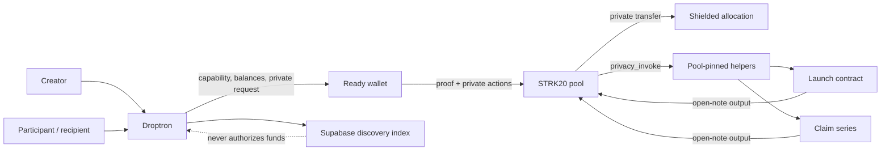

<div align="center">


# Droptron

[](LICENSE)


### Launch in public. Participate in private.

Droptron is private launch and distribution infrastructure for Starknet. Teams can create a token, run a public sale, distribute private allocations, publish airdrop claims, and schedule vesting from one product—while STRK20 keeps the wallet-to-allocation route private.

**[Read the docs](docs/README.md)** · **[See Mainnet evidence](docs/mainnet-evidence.md)** · **[Understand the privacy model](docs/privacy-model.md)** · **[Inspect the contracts](contracts/README.md)**

Built for the STRK20 Private Sprint and running on Starknet Mainnet.

</div>

---

## Contents

- [The problem](#the-problem)
- [What teams can do](#what-teams-can-do)
- [Why Droptron is different](#why-droptron-is-different)
- [Private distribution journey](#a-complete-private-distribution-journey)
- [STRK20 integration](#strk20-integration-end-to-end)
- [Privacy at a glance](#privacy-at-a-glance)
- [Architecture decisions](#architecture-decisions-that-matter)
- [Mainnet product status](#mainnet-product-status)
- [Run locally](#run-locally)
- [Repository map](#repository-map)
- [Wallet and replay safety](#wallet-behavior-and-replay-safety)
- [Security posture](#current-security-posture)
- [Documentation](#documentation)
- [Contributing](#contributing)

## The problem

Launching a token is rarely one operation. A team needs to create or select an asset, define sale terms, fund inventory, distribute contributor and community allocations, publish airdrops, manage vesting, and give recipients a reliable way to claim.

Today those steps are commonly split across scripts, spreadsheets, generic multisenders, public address lists, and separate claim applications. Besides being difficult to operate, that toolchain makes the ownership graph easy to reconstruct: who participated, who received a team allocation, who claimed an airdrop, and when a beneficiary unlocked vesting.

Droptron turns that fragmented process into one coherent Starknet workflow. It lowers the amount of custom launch infrastructure a team must build, makes token distribution accessible to smaller projects and communities, and adds privacy at the ownership layer instead of treating it as a later patch.

Droptron does not prescribe a project's tokenomics or economic policy. It gives teams the infrastructure to create a fixed-supply token—or bring an existing Starknet token—then execute the chosen sale, allocation, airdrop, and vesting plan through one coherent private distribution workflow.

## What teams can do

| Workflow | Creator experience | Participant or recipient experience |
| --- | --- | --- |
| **Token creation** | Deploy a fixed-supply Starknet token or select an existing token | Inspect the token used by a launch or distribution |
| **Launch** | Configure fixed or checked linear pricing, fund the sale, publish it, and settle after close | Browse without a product login, choose an allocation, and receive purchased tokens privately |
| **Disperse** | Validate a recipient list and send one atomic private batch | Receive a shielded allocation directly—no claim required |
| **Airdrop** | Create and fund an expiring claim-ticket series, then deliver tickets privately | Discover the ticket automatically and redeem it into shielded tokens |
| **Vesting** | Create one immutable claim series per unlock and deliver the complete schedule privately | See one vesting schedule, expand its tranches, and claim each unlocked allocation |
| **Wallet** | Prepare public or shielded inventory with actionable fee checks | Shield, transfer privately, claim, or unshield through the privacy wallet |

## Why Droptron is different

Most launchpads end at the sale. Most multisenders begin with a public recipient list. Most airdrop tools make the claimant and allocation easy to correlate.

Droptron treats the entire allocation lifecycle as one product:

- **The market remains legible.** Price, schedule, contract configuration, and aggregate activity stay public.
- **The ownership route becomes private.** Participation, private recipient delivery, bearer-ticket ownership, and resulting shielded balances use STRK20.
- **Airdrops and vesting share one primitive.** Fully collateralized claim tickets support both one-time distributions and multi-tranche schedules.
- **Disperse avoids unnecessary contracts.** Direct delivery uses one atomic STRK20 action batch rather than adding custody.
- **The interface understands real wallet conditions.** It checks live pool fees, token decimals, private balances, note maturity, recipient registration, and the next required action before opening the wallet.
- **Creator workflows are resumable.** Funding, shielding, delivery, and publication are separate stages, so a database retry cannot silently resend an allocation.
- **Privacy claims stay narrow.** Droptron explains what is public, what is private, and which state belongs to the wallet.

## A complete private distribution journey

| Stage | What happens |
| --- | --- |
| **Define** | The creator chooses a token, sale or distribution mode, recipients, amounts, and timing. |
| **Validate** | Droptron checks addresses, duplicates, totals, ERC-20 decimals, configured contracts, recipient registration, and live fee requirements. |
| **Fund** | Public launch inventory or claim-series collateral moves into the enforcing contract. |
| **Prepare privately** | The creator shields the exact asset or claim-ticket balance and reserves the live STRK20 fees required by the following action. |
| **Deliver** | STRK20 privately transfers an allocation, an atomic recipient batch, or bearer claim tickets. |
| **Discover** | Public launches appear in Explore; private claims are discovered by the recipient's wallet without exposing ownership to Droptron. |
| **Redeem** | An unlocked ticket is spent through a pool-pinned helper and the underlying token returns as a shielded note. |
| **Settle** | After a launch or expiring campaign closes, authorized creator controls recover the appropriate proceeds or unused collateral. |

## STRK20 integration, end to end

This is not a private-transfer button attached to a public launchpad. STRK20 participates throughout the product:

| Layer | Droptron integration |
| --- | --- |
| Wallet capability | Detects whether the connected Starknet wallet exposes the required privacy API before enabling private actions |
| Private state | Reads wallet-scoped shielded balances and claim-ticket holdings without receiving the viewing key or note registry |
| Asset preparation | Shields STRK or any supported conventional Starknet ERC-20 using its onchain decimals |
| Direct delivery | Sends private transfers and atomic multi-recipient action batches |
| Contract composition | Uses `privacy_invoke` with pool-pinned launch-participation and claim-redemption helpers |
| Private outputs | Returns purchased or redeemed tokens to the pool as open-note deposits for the wallet |
| Operational preflight | Reads the live pool fee, reserves multi-step fees, identifies public/private shortfalls, and waits for note maturity |

Ready owns viewing keys, private notes, proof generation, and private-state discovery. The browser never receives a seed phrase, private key, viewing key, proof secret, decrypted note registry, or prover configuration.



## Privacy at a glance

| Private through STRK20 | Public by design |
| --- | --- |
| Parties, token, and amount inside private transfers | Launch contract and token addresses |
| Shielded balances and note ownership | Price model, schedule, caps, and aggregate sale activity |
| Link between a participant and purchased allocation | Shield and unshield address, asset, amount, and timing |
| Airdrop and vesting ticket ownership | Vesting schedule and claim-series configuration |
| Recipient delivery inside a private batch | Deployed contract code and transaction inclusion |

STRK20 provides private note ownership and transfer—not an invisible blockchain. Droptron does not claim a hidden bonding curve, private public-deposit leg, or fully confidential market. See the complete [privacy model](docs/privacy-model.md).

## Architecture decisions that matter

| Decision | Why it matters |
| --- | --- |
| Public `Explore`, signed creator `Manage` | Anyone can discover a launch without a product login, while creator controls remain wallet-scoped. |
| Onchain authority, offchain discovery | Starknet contracts decide funds and claims; Supabase indexes public metadata and encrypted creator workspace data. |
| Pool-pinned helper contracts | Private launch participation and redemption compose with public contracts without accepting arbitrary callers. |
| Fully collateralized bearer tickets | Every claim ticket is backed one-to-one by the distributed token and is burned when redeemed. |
| One claim series per vesting tranche | Unlock timing remains immutable while the interface groups tranches into one understandable schedule. |
| Exact, scoped approvals | Claim-ticket allowances are tranche-specific and use the configured STRK20 pool rather than an unlimited spender. |
| Presentation-only pagination | Tables show ten recipients at a time, while validation, totals, registration checks, and execution use the full manifest. |
| One-shot execution guards | Synchronous locks, fingerprints, persisted stages, and idempotency keys prevent the application from reopening completed creator actions. |

The detailed system boundary, source-of-truth table, contract composition, and replay model live in [docs/architecture.md](docs/architecture.md).

## Mainnet product status

The core paths have been exercised on Starknet Mainnet with deliberately small values:

| Surface | Result |
| --- | --- |
| Launch | DROP Genesis launch deployed, funded, published, and privately joined |
| Disperse | Atomic two-recipient private batch completed |
| Airdrop | Tickets created, funded, privately delivered, discovered, and redeemed into shielded DROP |
| Vesting | Two immutable tranche series created, funded, privately delivered, and discovered as one schedule |
| Claims | Automatic wallet-scoped discovery and fee-aware private redemption completed |

### Core deployments

| Component | Mainnet address |
| --- | --- |
| STRK20 pool | [`0x040337…fe812a`](https://voyager.online/contract/0x040337b1af3c663e86e333bab5a4b28da8d4652a15a69beee2b677776ffe812a) |
| Launch participation helper | [`0x05c1ae…1b995e`](https://voyager.online/contract/0x05c1ae66fb281ca0451b570bcad29c87cfa4e34b4552aec47ed8bd0a161b995e) |
| Distribution factory | [`0x06bd6c…f3a2d3`](https://voyager.online/contract/0x06bd6c7716abff65de60874e30f644c1dfede3f82ca087e2ccabc09544f3a2d3) |
| Claim redemption helper | [`0x018590…d4efe`](https://voyager.online/contract/0x018590ba519e985ff0ca35d8ef4132b1d3ac34605dd5c2c123e651eea08d4efe) |
| DROP Genesis launch | [`0x05031d…052794`](https://voyager.online/contract/0x05031da27a3def65a2ab92247fc81b840a827280625356134ae8c04e2d052794) |

### Product evidence

| Flow | Mainnet transaction | What it demonstrates |
| --- | --- | --- |
| Launch deployment | [`0x1b9f6c…f4e8f`](https://voyager.online/tx/0x1b9f6c249d0bc6d675e7eb7b04784558e6237591ddd958b4ac075c0340f4e8f) | Creator-configured sale contract deployed |
| Launch funding | [`0x36582e…fa600`](https://voyager.online/tx/0x36582e6064c99eafc761244cf38deced53f94142ea258a6718cf06b4a7fa600) | Complete 1,000 DROP allocation funded |
| Private participation | [`0x00fcb6…bbd76`](https://voyager.online/tx/0x00fcb612b93683c76cc75c3db02f2aeaf4fe75cff2768e7b8c8b23c2f01bbd76) | Public purchase executed with shielded output |
| Private Disperse | [`0x74bf92…eac52`](https://voyager.online/tx/0x74bf92804c5729099dfdb7910f1cad1d0eca8925f06aea1a5d08444692eac52) | Atomic private recipient batch |
| Airdrop delivery | [`0x1d621e…e14ef`](https://voyager.online/tx/0x1d621e01eaa408783e7414d212ae086479b275181dd81b16f390f0e146e14ef) | Private bearer tickets delivered |
| Airdrop redemption | [`0x037042…7e946`](https://voyager.online/tx/0x03704277323cacf7c2d3df3d2c710386c8dfa2df08f3633113bee2d262d7e946) | Ticket spent and shielded DROP returned |
| Vesting delivery | [`0x1a652a…d4c52`](https://voyager.online/tx/0x1a652a277121078da04388530e5637e5789bdeab41ecabe5f7ff013337d4c52) | Two private tranche tickets delivered and discovered |

Every supporting deployment and the remaining demonstrations are tracked in [Mainnet evidence](docs/mainnet-evidence.md).

## Run locally

### Requirements

- Node.js 20+ and npm
- A Starknet wallet; Ready is required for the current STRK20 private actions
- Scarb 2.20.1 and Starknet Foundry 0.63.0 for Cairo development
- A Supabase project for shared discovery, signed creator persistence, and encrypted recipient manifests

### Application

```bash
git clone https://github.com/Femtech-web/droptron-launchpad.git
cd droptron-launchpad
npm ci
cp .env.example .env.local
npm run dev
```

Open [http://localhost:3000](http://localhost:3000), configure the public Mainnet addresses in `.env.local`, then apply the migrations described in [supabase/README.md](supabase/README.md).

Never expose `SUPABASE_SECRET_KEY`, `DROPTON_DATA_ENCRYPTION_KEY`, a private key, seed phrase, or viewing key through a `NEXT_PUBLIC_` variable.

### Contracts

```bash
cd contracts
scarb build
snforge test
```

The Cairo suite currently contains **69 passing tests** covering pricing, decimal normalization, overflow rejection, funding, settlement, caps, cancellation, exact token deltas, malicious tokens, reentrancy, ticket collateral, early and duplicate claims, rollback, and collateral conservation.

## Repository map

| Path | Purpose |
| --- | --- |
| `src/app/` | Next.js pages, APIs, metadata, and the public documentation route |
| `src/features/` | Wallet, privacy, launch, distribution, claim, and creator workflows |
| `src/lib/` | Persistence, sessions, encryption, and Starknet support code |
| `contracts/src/` | Production Cairo contracts and isolated mocks |
| `contracts/tests/` | Unit, integration, rollback, adversarial, and fuzz coverage |
| `supabase/migrations/` | Creator sessions, encrypted drafts, public discovery, and claims metadata |
| `docs/` | Public architecture, privacy, evidence, wallet, and safety references |
| `.github/` | Pull-request guidance and the independent CI quality gate |
| `scripts/` | Guarded class declaration, deployment, and Mainnet configuration tooling |

## Wallet behavior and replay safety

- A standard shield may require two distinct confirmations: exact ERC-20 approval, then STRK20 pool deposit.
- Newly shielded notes generally need about ten blocks before the next private spend.
- Ready may label exact ticket approvals as high risk; users should still verify the configured pool, amount, and tranche count.
- Ready has sometimes redisplayed an already successful private request. If Droptron shows success or a terminal state and the wallet presents an identical action, reject it.
- Droptron prevents intentional resubmission with synchronous locks, request fingerprints, persisted stage checks, and one-shot idempotency keys. Wallet Standard does not allow a dapp to dismiss a request already owned by the wallet window.
- Starknet nonces and STRK20 nullifiers constrain exact transaction or note replay. A future contract revision can add a salted one-time intent commitment for stronger semantic replay protection.

Read [wallet integration](docs/wallet-integration.md) and [testing and safety](docs/testing-and-safety.md) for the full operational model.

## Current security posture

Droptron is hackathon-stage, unaudited software running deliberately small-value Mainnet tests. Production Cairo files received targeted AI-assisted review and 69 local tests pass, but this is not an independent audit or a security guarantee.

Before meaningful value, the contracts require independent review, live adversarial testing, operational monitoring, and a deliberate upgrade or migration policy. Conventional Starknet ERC-20s with 0–18 decimals are supported; fee-on-transfer, rebasing, and non-standard balance semantics are rejected rather than approximated.

Review the implemented signing, approval, persistence, replay, and contract safeguards in [Security controls](docs/security-controls.md). Report suspected vulnerabilities privately as described in [SECURITY.md](SECURITY.md).

## Documentation

- [Documentation index](docs/README.md)
- [Architecture](docs/architecture.md)
- [Product experience](docs/product-experience.md)
- [Privacy model](docs/privacy-model.md)
- [Security controls](docs/security-controls.md)
- [Mainnet evidence](docs/mainnet-evidence.md)
- [Wallet and STRK20 integration](docs/wallet-integration.md)
- [Testing and safety](docs/testing-and-safety.md)
- [Contract reference](contracts/README.md)
- [Persistence setup](supabase/README.md)

## Contributing

See [CONTRIBUTING.md](CONTRIBUTING.md) for setup, repository conventions, validation expectations, and the pull-request checklist. Keep privacy claims narrow and testable, and never commit wallet secrets or plaintext production recipient manifests.

### Quality gates

Run the same full validation used before a Mainnet release:

```bash
npm run verify
```

Husky type-checks work before each commit. Before a push it runs the complete web and Cairo suite when the local Cairo toolchain is available, or the web gate with a clear warning when it is not. GitHub Actions always runs both gates independently for every pull request and every push to `main`. Make the **Quality gate** workflow a required status check in the repository's `main` branch protection settings so failed code cannot be merged for deployment.

## License

[MIT](LICENSE) © 2026 Droptron contributors.
